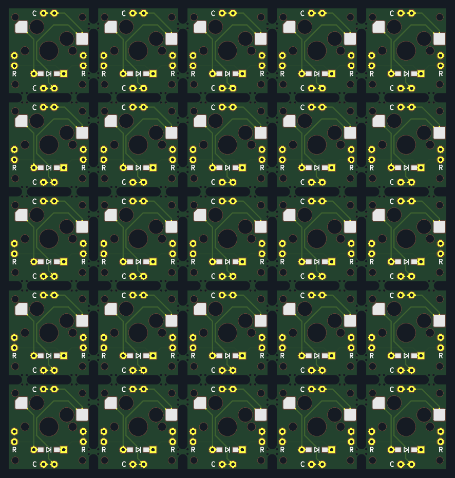

# Single MX Hotswap (Cherry)

Single MX Hotswap PCB for hand wiring dactyl-manuform keyboards and their derivatives.

- 17x18x1.6mm (W x L x H)
- 1N4148W diode (SMT or THT)
- Kailh MX Hotswap Socket
- 2 cols / 2 rows on each side
- 4 screw holes (M1.4)

Panelization and fabrication is made possible by [KiKit – Automation for KiCAD](https://github.com/yaqwsx/KiKit).


 

 
## Panelization

```
kikit panelize --layout "grid; rows: 5; cols: 5; space: 2mm" --tabs "annotation" --cuts "mousebites; drill: 0.5mm" --post "millradius: 1mm" pcb/single.kicad_pcb pcb/panel.kicad_pcb
```

## Fabrication (JLCPCB)

```
kikit fab jlcpcb pcb/panel.kicad_pcb pcb/out
```


## Credits

This model is based off [su120-keyboard](https://github.com/e3w2q/su120-keyboard) and it's stripped down [panel](https://github.com/kissetfall/su120-keyboard).

| Footprint | Author | Modification |
| --------- | ------ | ------- |
| 1pin_conn | [su120-keyboard](https://github.com/e3w2q/su120-keyboard) | Removed silkscreen.
| diod_TH_SMD | [su120-keyboard](https://github.com/e3w2q/su120-keyboard) | Top orientation only. Changed diode symbol.
| MX-Hotswap-1U | [MX_V2](https://github.com/ai03-2725/MX_V2) | 17x18mm (W x L). Added charm on left pad.
